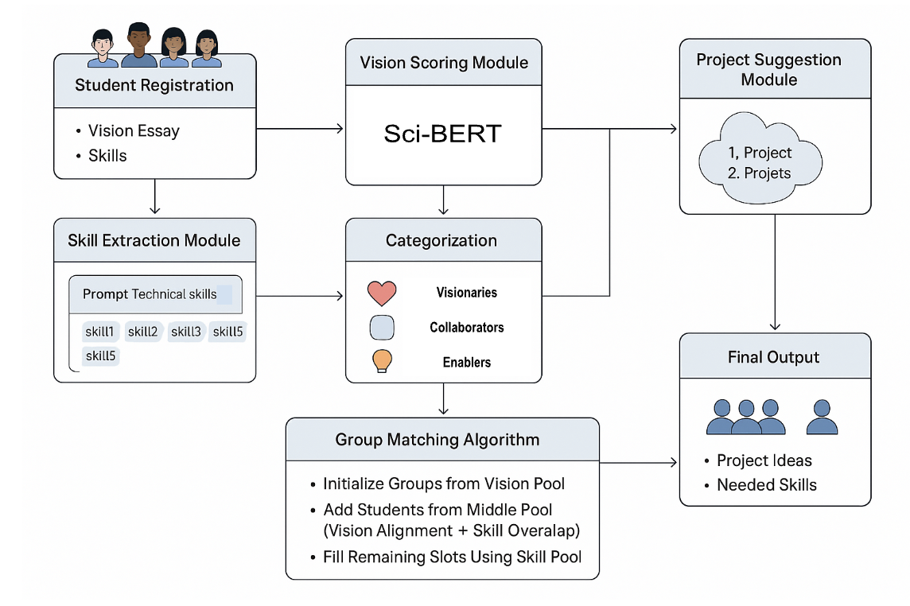
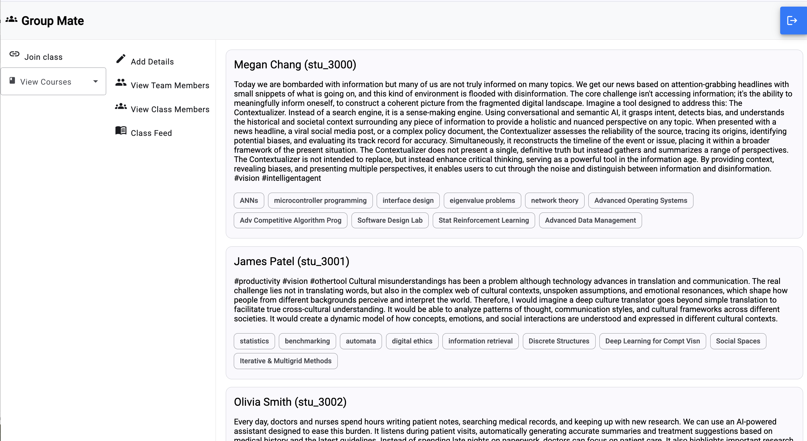
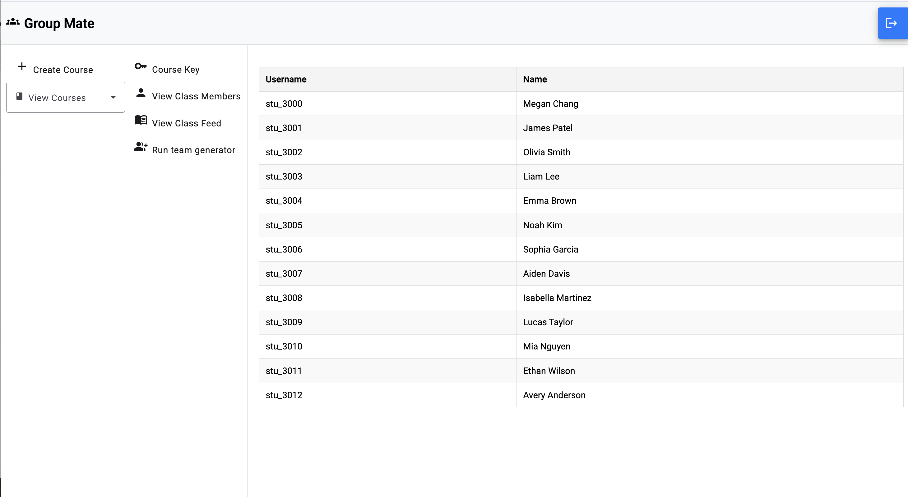

# GroupMate: A Role-Aware Team Formation System for Academic Collaboration
GroupMate is a full-stack AI system that intelligently forms student teams in academic settings by analyzing project proposals, skills, and course histories. It leverages a fine-tuned SciBERT model to assess project novelty, categorizes students into functional archetypes (Visionaries, Collaborators, Enablers), and optimizes group composition for innovation and execution.
## Why GroupMate?
Traditional team formation is tedious, biased, and often unbalanced. GroupMate solves this by:

- Using **project proposals** to understand what excites students.
- Applying **transformer-based scoring models** to classify students by role.
- Forming teams with balanced roles and complementary skills.
- Suggesting **LLM-generated project ideas** based on group profiles.

---
## System Overview

GroupMate consists of the following modular components:

1. **Vision Scoring Module**:

   Uses a SciBERT-based regressor to compute novelty scores for student essays and assign roles:  
   - Visionary  
   - Collaborator  
   - Enabler

2. **Skill Extraction Module**  

   Uses LLM prompting to infer technical domains from skills and course history.

3. **Group Matching Algorithm**  

   Seeds each team with a Visionary, adds Collaborators for conceptual fit, and fills gaps with Enablers to ensure technical coverage and balance.

4. **Project Suggestion Module**  

   Generates project ideas using each group’s aggregated vision and skill profile.

---
## User Roles & Workflow

GroupMate supports two main user types, each with distinct responsibilities in the team formation process:

### Students

- Join a course using a unique code provided by the instructor.
- Submit:
  - A vision essay outlining their project interest.
  - Their technical skillset and relevant coursework.
- Once submissions are closed, students are assigned to teams.
- Receive:
  - Team composition.
  - Project suggestions generated by an LLM, based on the team’s combined inputs.

---

### Instructors

- Register and create a course on the platform.
- Share course code to onboard students.
- Once all students are registered and submissions are complete:
  - Trigger team formation with one click.
  - Review and finalize team compositions.
  - Monitor student participation and optionally make adjustments before publishing teams.

---

## Built With

- **Angular** (Frontend UI)
- **Django** (Backend APIs)
- **Gemini** (LLM-based skill extraction and project suggestions)
- **SQLite** (Data Storage and Retrieval)
- **SciBERT** (Vision Scoring Model)
- **Specter Embedding** (Category Clustering)
- **arXiv Dataset** (for novelty heuristic training)

---

## Acknowledgements

- Based on research inspirations from [Belbin Team Roles](https://www.belbin.com/about/belbin-team-roles)
- Dataset courtesy of [arXiv](https://www.kaggle.com/datasets/Cornell-University/arxiv)
- Built at the University of Illinois Urbana-Champaign

